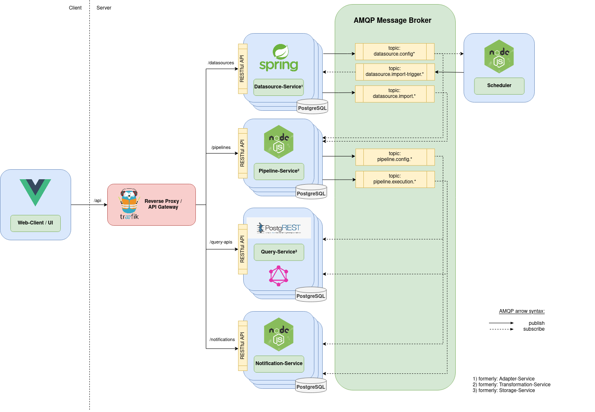
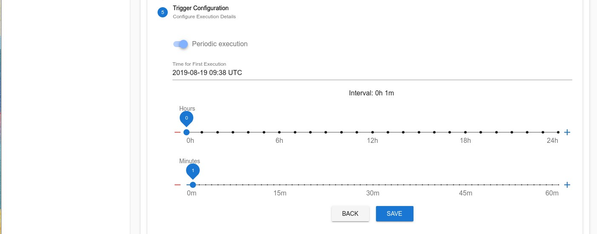
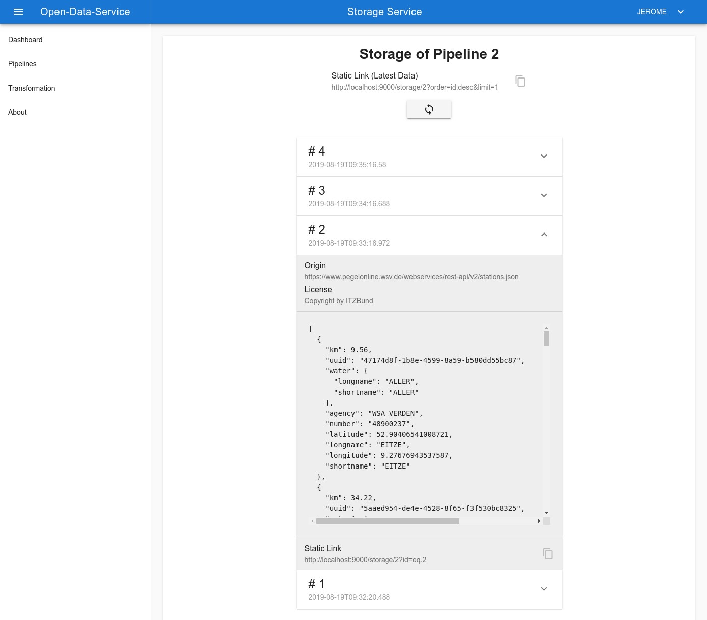

# ODS-Main

Main project for ODS. All related microservice projects for ODS are located in sub-directories.

## Project Structure

We use the microservice architectural style in this project. The microservices are located in the sub-directories and communicate at runtime over network with each other. Each Microservice has its own defined interface that has to be used by other services, direct access to the database of other microservices is strictly prohibited. In production, each microservice can be multiplied in order to scale the system (except the scheduler at the moment).

| Microservice | Description |
|----|----|
| Web-Client / UI | easy and seamless configuration of Sources, Pipelines | 
| Core-Service | stores and manages configurations for Pipelines |
| Scheduler | orchestrates the executions of Pipelines |
| Adapter-Service | fetches data from Sources and imports them into the system |
| Transformation-Service | execution of data transformations |
| Storage-Service | stores data of Pipelines and offers an API for querying |
| Auth-Service | user authentication and authorization |
| Reverse-Proxy | communication of UI with backend microservices indenepdent from deployment environment |

## Run

Use `docker-compose up` to run all microservices in production mode.

Use `docker-compose -f docker-compose.yml -f docker-compose.ci.yml up <services>` for starting up specific services in development mode and intergation tests. See sub-directories for futher information.

## Getting Started

### Using API

You can finde example requests for the api under [doc/example-requests](./doc/example-requests).

### Using the UI

The easiest way to use the ODS is via the UI. If you started the ODS with docker-compose you can access the UI under `http://localhost:9000/ui/index.html`.  If you click on any of the pages you need to authenticate yourself to proceed to the pages. For that, you can use the already existing user `demo` with the password `demo`.

To demonstrate the ODS we will create a new pipeline to fetch water level data for German rivers and have a look at the collected data.

First, go to the Pipelines page and click on `Create new Pipeline`.
The configuration workflow for creating a new pipeline is divided into the following five steps. 

Step 1: Name the pipeline.

Step 2: Configure an adapter to crawl the data. You can use the prefilled example settings.

Step 3: In this step, you can manipulate the raw data to fit your needs by writing JavaScript code.
The `data` object represents the incoming raw data. 
In this example, the attribute `test` is added to the `data` object before returning it.

Step 4: Describe additional meta-data.

Step 5: Configure the interval of how often the data should be fetched. 
If `Periodic execution` is disabled the data will be fetched only once.
With the two sliders, you can choose the interval duration. 
The first execution of the pipeline will be after the `Time of First Execution` plus the interval time.
Please choose 1 minute, so that you don't have to wait too long for the first data to arrive.

The configuration of the pipeline is now finished. In the overview, you see now the recently created pipeline. 

By clicking on the `Data` button inside the table you see the collected data by the pipeline.

In this storage view, you see all data sets for the related pipeline. On top of this list, a static link shows the URL to fetch the data with a REST client.
Each data entry in the list can be expanded to see the fetched data and additional meta-data.

# License

Copyright 2019 Friedrich-Alexander Universität Erlangen-Nürnberg

This program is free software: you can redistribute it and/or modify it under the terms of the GNU Affero General Public License as published by the Free Software Foundation, either version 3 of the License, or (at your option) any later version.

This program is distributed in the hope that it will be useful, but WITHOUT ANY WARRANTY; without even the implied warranty of MERCHANTABILITY or FITNESS FOR A PARTICULAR PURPOSE. See the GNU Affero General Public License for more details.

You should have received a copy of the GNU Affero General Public License along with this program. If not, see http://www.gnu.org/licenses/.

SPDX-License-Identifier: AGPL-3.0-only
